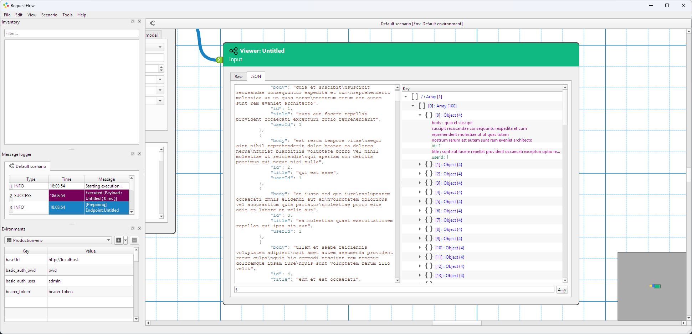
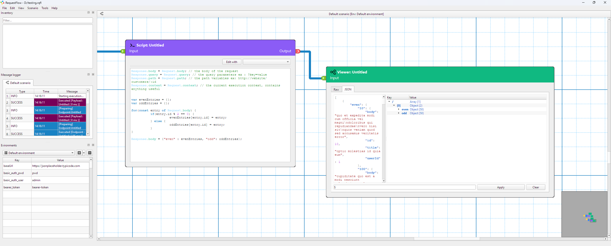

# RequestFlow

**REST API Testing for Human Beings**


[](https://github.com/fatehmtd/RequestFlow/actions/workflows/build-linux.yml)
[](https://github.com/fatehmtd/RequestFlow/actions/workflows/build-macos.yml)
[](https://github.com/fatehmtd/RequestFlow/actions/workflows/build-windows.yml)

RequestFlow is a visual, node-based REST API testing tool. Design API test workflows by connecting nodes on a canvas instead of writing scripts or managing configuration files.

<p align="center">
  
  <br>
  <em>RequestFlow's visual node-based workflow editor</em>
</p>

---

## Why RequestFlow?

RequestFlow takes a visual approach to API testing. Build workflows by dragging nodes onto a canvas and connecting them. See your data flow, add conditional logic, run scripts, and validate responses in a graphical interface.

Useful for:
- Testing API workflows with multiple requests
- Debugging API flows by inspecting data at each step
- Building reusable test scenarios

---

## Features

### Visual Workflow Design
Build API test flows using a drag-and-drop node editor. Connect HTTP requests, data transformations, conditionals, and assertions visually.

<p align="center">
  
  <br>
  <em>Complex API workflows made simple with visual connections</em>
</p>

### Node Types

- **Endpoint Nodes** - HTTP client supporting REST methods (GET, POST, PUT, DELETE, PATCH, HEAD, OPTIONS)
  - Authentication: None (default), Basic Auth, or Bearer tokens
  - Path and query variable substitution from upstream nodes with automatic URL encoding
  - Custom headers, timeouts, user agents, and content types
  - Response validation with configurable accepted (200, 201 by default) and rejected (404, 401, 500) status codes

- **Payload Nodes** - Data source management
  - Load messages from files or define inline JSON
  - Define path variables and query parameters (e.g., `http://api/{userId}?{status}`)
  - Inject data into your workflow

- **Script Nodes** - JavaScript execution for data transformation
  - Access message context: Request.body, Request.query, Request.path, Request.context
  - Transform responses, extract values, manipulate data

- **Assertion Nodes** - Validate API responses
  - Built-in assertions: equals, contains, true/false checks
  - Access response data and write custom validation logic

- **Conditional Nodes** - Workflow branching (under development)
  - JavaScript conditions for dynamic execution paths
  - Enable/disable branches based on runtime data
  - Note: Full condition evaluation implementation in progress

- **Delay Nodes** - Timing control
  - Add configurable delays between operations
  - Millisecond precision

- **Viewer Nodes** - Data inspection
  - View messages at any workflow step
  - JSONPath filtering for data structures
  - Export responses to JSON files

- **External Nodes** - Workflow composition
  - Reference nodes from other graphs
  - Configurable execution conditions

- **Group Nodes** - Visual organization (under development)
  - Planned: Color-coded grouping for related nodes
  - Planned: Keep workflows organized
  - Note: Basic structure exists but UI and workflow integration not yet implemented

<p align="center">
  
  <br>
  <em>Configuring HTTP requests with authentication and headers</em>
</p>

### Environment Management
Switch between environments (dev, staging, production) and define variables. Use `{variable}` syntax anywhere in your requests.

<p align="center">
  
  <br>
  <em>Manage multiple environments with ease</em>
</p>

### Message Flow Tracking
Inspect data at each step of your workflow: request bodies, response headers, query parameters, and path variables.

<p align="center">
  
  <br>
  <em>Inspect response data at any workflow step</em>
</p>

### JavaScript Integration
Built-in JavaScript engine (QJSEngine) with JSONPath library for data manipulation and assertions.

<p align="center">
  
  <br>
  <em>Write custom JavaScript for data transformation and logic</em>
</p>

### Data Filtering
Filter JSON responses using JSONPath expressions. Export filtered data for analysis.

<p align="center">
  
  <br>
  <em>Filter data with powerful JSONPath expressions</em>
</p>

### Project Management
Save your workflows as `.rqfl` project files. Organize multiple test scenarios, version control your tests, and share them with your team.

### Dark/Light Themes
Choose between dark and light themes.

### Proxy Support
Configure HTTP or SOCKS5 proxy with optional authentication in Settings.

### Keyboard Shortcuts
- **Ctrl+D** - Duplicate selected node
- **Delete** - Delete selected nodes and edges
- **F2** - Rename selected node with dialog prompt
- **Ctrl+F** - Find and navigate to nodes
- **Mouse Wheel** - Zoom in/out (no Ctrl required)
- **Middle Mouse Button** - Pan canvas

### Recent Projects & Samples
Quick access to recently opened projects from the File menu. Sample projects are automatically discovered from the `samples/` directory and accessible via File > Sample projects.

### Swagger/OpenAPI Import
Import API definitions from Swagger JSON files (Tools > Swagger Import). Imported endpoints appear in the Inventory panel where you can drag and drop them directly onto the canvas as pre-configured Endpoint nodes with URL, HTTP method, and parameters already set.

---

## Getting Started

### Download

Pre-built binaries are available for Windows, macOS, and Linux:

**[Download from GitHub Releases](https://github.com/fatehmtd/RequestFlow/releases)**

- **Windows:** Installer with all dependencies included (Windows 10/11, 64-bit)
- **macOS:** Universal binary for Intel and Apple Silicon (macOS 10.14+)
- **Linux:** AppImage for major distributions (Ubuntu 20.04+, Fedora, etc.)

### Installation Instructions

#### macOS
1. Download `RequestFlow-macOS.dmg` from the releases page
2. Open the DMG file (double-click)
3. Drag `RequestFlow.app` to the Applications folder shortcut
4. Eject the DMG
5. **Important:** Before first launch, remove quarantine attributes by running this in Terminal:
   ```bash
   xattr -cr /Applications/RequestFlow.app
   ```
6. **On first launch:** Right-click the app in Applications and select "Open" (required for unsigned apps)
7. Click "Open" in the security dialog that appears
8. The app will now run normally

**Note:** Since the app is currently unsigned, macOS Gatekeeper requires these extra steps. The `xattr -cr` command removes quarantine attributes that cause the "damaged" error, and right-click → Open bypasses the signature requirement.

#### Linux
1. Download `RequestFlow-Linux-x86_64.AppImage` from the releases page
2. Make it executable: `chmod +x RequestFlow-Linux-x86_64.AppImage`
3. Run it: `./RequestFlow-Linux-x86_64.AppImage`

#### Windows
1. Download `RequestFlow-Windows-x64.zip` from the releases page
2. Extract the ZIP file to your preferred location
3. Run `RequestFlow.exe`

### Building from Source

Requirements:
- Qt 5.15.2+ or Qt 6.x
- C++17 compatible compiler (MSVC 2019+, GCC, or Clang)
- Qt modules: Core, GUI, Network, Widgets, QML, SVG, OpenGL

```bash
git clone https://github.com/fatehmtd/RequestFlow.git
cd RequestFlow/RequestFlowApp
qmake RequestFlow.pro
make
```

See [CONTRIBUTING.md](CONTRIBUTING.md) for detailed build instructions and development setup.

---

## Project Status

⚠️ **Early Release Notice**

RequestFlow is in active development and represents an early release. While the core features are functional and ready for testing, you may encounter bugs, rough edges, or undefined behavior. This is expected for a young project, and we're working continuously to improve stability and add polish.

**What this means for you:**
- The application is usable for real API testing workflows
- Some edge cases may not be handled gracefully yet
- Features are being added and refined regularly
- Your bug reports and feedback directly improve the project
- Breaking changes may occur as we refine the architecture

**We need your help!** This is a community-driven project, and contributions are essential:
- **Report bugs** you encounter via [GitHub Issues](https://github.com/fatehmtd/RequestFlow/issues)
- **Share feature ideas** and use cases to shape the roadmap
- **Contribute code** for bug fixes, features, or improvements
- **Improve documentation** by clarifying confusing parts or adding examples
- **Test on your platform** and report platform-specific issues

By using RequestFlow in this early stage, you're helping build a better tool for the entire community. We appreciate your patience and contributions!

---

## Contributing

We welcome contributions! Whether it's bug fixes, new features, documentation, or UI improvements, your help makes RequestFlow better for everyone.

Ways to contribute:
- Report bugs and suggest features via [GitHub Issues](https://github.com/fatehmtd/RequestFlow/issues)
- Implement new node types or workflow capabilities
- Improve the UI/UX
- Write documentation and tutorials
- Fix platform-specific issues
- Add test coverage

See [CONTRIBUTING.md](CONTRIBUTING.md) for guidelines on code style, pull requests, and development workflow.

---

## Technology Stack

- **Qt 6.x** - UI and networking
- **C++17** - Core logic
- **QGraphicsView** - Node-based editor
- **QJSEngine** - JavaScript execution
- **QNetworkAccessManager** - HTTP client

---

## License

RequestFlow is open source software licensed under the [MIT License](LICENSE).

---

## Author

Created and maintained by **Fateh Benmerzoug, Ph.D**

- Email: fatehmtd+requestflow@gmail.com
- Website: [fatehmtd.github.io/RequestFlow](https://fatehmtd.github.io/RequestFlow)
- GitHub: [@fatehmtd](https://github.com/fatehmtd)

---

## Built With

<p align="center">
  <a href="https://www.qt.io/">
    
  </a>
</p>

RequestFlow is proudly built with the [Qt Framework](https://www.qt.io/) - a powerful cross-platform application development framework. Qt enables us to deliver a native experience on Windows, macOS, and Linux from a single codebase.

**Qt Modules Used:**
- **Qt Widgets** - Modern, responsive UI components
- **Qt Network** - HTTP/HTTPS client functionality
- **Qt SVG** - Scalable vector graphics for crisp icons
- **Qt QML/Quick** - Declarative UI elements
- **QGraphicsView** - High-performance node-based canvas

We're grateful to the Qt Company and the Qt open source community for making this project possible.

---

## Acknowledgments

Special thanks to the open source community for inspiration and support.

---

**Start building visual API workflows today. Download RequestFlow and see the difference.**
